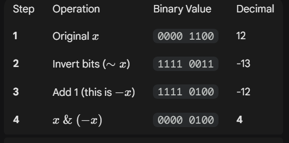

# Bit Manipulation

## Main Operations

<table><thead><tr><th width="125">Symbol</th><th width="144.33333333333331">Operation </th><th>Effect</th></tr></thead><tbody><tr><td>~</td><td>not</td><td>0 -> 1, 1 -> 0</td></tr><tr><td>|</td><td>or</td><td></td></tr><tr><td>&#x26;</td><td>and</td><td></td></tr><tr><td>^</td><td>xor</td><td>0 + 1 -> 1, 1 + 1 -> 0, 0 + 0 -> 0</td></tr><tr><td>&#x3C;&#x3C;</td><td>shift left</td><td>&#x3C;&#x3C;1 = multiply by 2</td></tr><tr><td>>></td><td>shift right</td><td>>>1 = divide by 2</td></tr></tbody></table>

Note:&#x20;

Python bin() built-in function return 0b + bit representation of a number

Python \~ work on signed int, so directly use \~ to find the invert of 1 bit will yield unexpected result, try use a ^ \~ a or a + \~ a instead.

Negative numbers are written with a leading one instead of a leading zero.

Python doesn't use 8-bit numbers. It USED to use however many bits were native to your machine, but since that was non-portable, it has recently switched to using an INFINITE number of bits. Thus the number -5 is treated by bitwise operators as if it were written "...1111111111111111111011".

If we keep on shifting the negative number to the right, we will end up with 11111.... eventually

[https://wiki.python.org/moin/BitwiseOperators](https://wiki.python.org/moin/BitwiseOperators)

## Two-complements

From Wiki

[https://en.wikipedia.org/wiki/Two%27s\_complement](https://en.wikipedia.org/wiki/Two's_complement)

* How to get / isolate the rightmost 1-bit : `x & (-x)`.

<figure><figcaption></figcaption></figure>

* How to turn off (= set to 0) the rightmost 1-bit : `x & (x - 1)`.

## Properties of XOR

a ^ b = c implies a = b ^ c or b = a ^ c

So if we have a set of prefix\_xor where prefix\_xor\[i] = 0 ^ nums\[1] ^ nums\[2] ^... ^ nums\[i - 1]

We can find the xor results of numbers between i and j by prefix\_xor\[j + 1] ^ prefix\_xor\[i]&#x20;

Practise 722 [https://www.lintcode.com/problem/722/](https://www.lintcode.com/problem/722/)

## State Compression

Interesting problem&#x20;

Leetcode 2791 : [https://leetcode.com/problems/count-paths-that-can-form-a-palindrome-in-a-tree/](https://leetcode.com/problems/count-paths-that-can-form-a-palindrome-in-a-tree/)

Idea:&#x20;

**Storing the states:**

keep the count of path with odd number of char (from 'a' to 'z') ,&#x20;

Since for every character from 'a' to 'z', there is either odd or even (include 0) number of the char,&#x20;

The state will have 2 \*\* 26 \~ roughly 10 \*\* 8 digits. Use binary bits for state representation.&#x20;

**The hard part:**

for each pair of nodes A and B, for the path from node A to root with a specific state (count of odd char from 'A' to 'z'), if there is another path from node B to root with the same state, that the path between node A and node B can form the palindrome.&#x20;

What happened if the LCA of node A and node B is lower than the root? in this case since node A & B will go through same path after the LCA, any odd counts after the LCA will be evened out.&#x20;

Now the last part, there could be case where a palindrome can be formed with a single odd char. To check for all possibility, simply add one char to the state for A and see if there is matching state in B. (state\_A ^= 1 << i for i in range(26))

## Good Practice Questions

[https://leetcode.com/problems/maximum-bitwise-and-after-increment-operations/description/](https://leetcode.com/problems/maximum-bitwise-and-after-increment-operations/description/)

