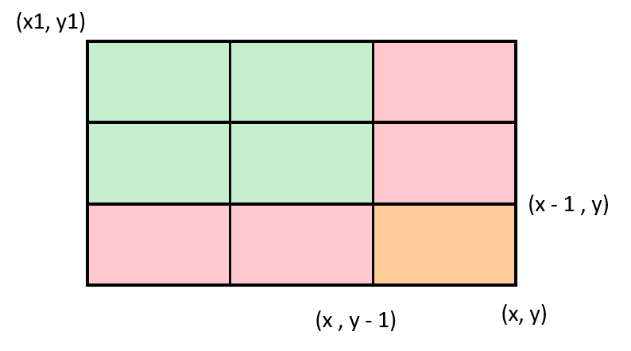

# Mo's Algorithm (SQRT)

Also known as sqrt decomposition

Ref: [https://cp-algorithms.com/data\_structures/sqrt\_decomposition.html](https://cp-algorithms.com/data_structures/sqrt_decomposition.html)

In basic form

<figure><figcaption></figcaption></figure>

<figure><figcaption></figcaption></figure>

