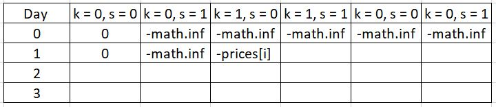

# Best Time to Buy and Sell Stock

121 and 122 are easy, things get harder when we are limited by K number of transaction

**Special case**: if k \* 2 > n, we can just buy low and sell high when iterating through all n.&#x20;

Otherwise, we need:

**State:**  dp \[ day ] \[ used\_buy\_transaction ] \[ holding stock ], where used\_buy\_transaction ranges from 0 to k, holding stock = 0 (if not holding any stock) or 1

**Transition Functions:**&#x20;

For each day and each number of used\_buy\_transaction we have two states, each state with two possibilities,&#x20;

dp \[ day ] \[ used\_buy\_transaction ] \[ 0 ] = dp \[ day - 1 ] \[ used\_buy\_transaction ] \[ 0 ]  (if we don't buy any stock)

dp \[ day ] \[ used\_buy\_transaction ] \[ 0 ] = dp \[ day - 1 ] \[ used\_buy\_transaction ] \[ 1 ] + prices\[day]      (if we sell the stock previously hold)

dp \[ day ] \[ used\_buy\_transaction ] \[ 1 ] = dp \[ day - 1 ] \[ used\_buy\_transaction - 1 ] \[ 0 ] - prices\[day] (if we buy the stock on the day)

dp \[ day ] \[ used\_buy\_transaction ] \[ 1 ] = dp \[ day - 1 ] \[ used\_buy\_transaction ] \[ 1 ]&#x20;

(if we simply hold the stock from the previous day)

**Initial Conditions:**&#x20;

set dp\[0]\[0]\[0] as 0 , and the rests as - math.inf  ( so that on day 1 the best option is to buy the stock as starting point . See illustration belows

<figure><figcaption></figcaption></figure>

121. &#x20; Best Time to Buy and Sell Stock [https://leetcode.com/problems/best-time-to-buy-and-sell-stock/](https://leetcode.com/problems/best-time-to-buy-and-sell-stock/)
122. &#x20; [https://leetcode.com/problems/best-time-to-buy-and-sell-stock-ii/](https://leetcode.com/problems/best-time-to-buy-and-sell-stock-ii/)
123. &#x20; [https://leetcode.com/problems/best-time-to-buy-and-sell-stock-iii/submissions/](https://leetcode.com/problems/best-time-to-buy-and-sell-stock-iii/submissions/)
124. &#x20;  Best Time to Buy and Sell Stock IV  [https://leetcode.com/problems/best-time-to-buy-and-sell-stock-iv/](https://leetcode.com/problems/best-time-to-buy-and-sell-stock-iv/)
