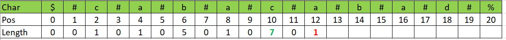
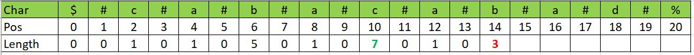
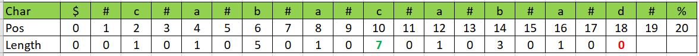

# Manacher’s Algorithm

## Problem

Given a string `s`, return _the longest_ _palindromic_ _substring_ in `s`.

## Preprocessing

Convert string with even length to odd length by padding a special token (eg. '#' ) between each character. The odd length string will remain odd after this conversation.&#x20;

Add two different special characters at the start and end of the new string, to make it easy to detect edge cases (for the first and last character of the original string),&#x20;

Example 1: "abba" become "$#a#b#b#a#%"

Example 2: "aba" become "$#a#b#a#%"

## Starting from Brute Forces

For each potential center position, extend the length of the palindrome if the character of the left edge is the same as the character of the right edge.&#x20;

Example: for "$#a#b#b#a#%", starting from position 1 as the center with palindrome length of 0, since the edge characters, s\[0] = $ != s\[2] = #. Stop and record the max palindrome length as 0.&#x20;

for position 5 (char #) as the center, it will start comparing positions 4 and 6 (both are 'b'), then position 3 and 7 (both are '#') till the end. which found a palindrome length  of 3

The longest palindromic substring is then the substring of  (max\_center - max\_len)//2 : (max\_center + max\_len)//2 of the original string

## Manacher's&#x20;

Notice that if we already determined the max palindrome length of 3 at position 4 for "$#a#b#b#a#%", for the remaining position from position 5 till position 7 which is the right side of the palindrome, we need not repeat the comparisons as the string is symmetrical between left and right.&#x20;

In summary, there are three potential cases when computing the palindrome length of the new positions

Case 1: The new position i is within the previous right bound of the found palindrome and the max\_length of the opposite position (center - i) is **smaller or equal to** the remaining distance from i to the right bound. In this case, take the max\_length of the opposite position as starting point and try to extend the palindrome length from there

<figure><figcaption><p>In this example, i = 12, previous center = 10, previous length = 7, right bound = 17, opposite position = 10 - 2 = 8, max length of the opposite center is thus 1</p></figcaption></figure>

Case 2: The new position i is within the previous right bound of the found palindrome and the max\_length of the opposite position (center - i) is **greater than** the remaining distance from i to the right bound. In this case, take the remaining distance as starting point and try to extend the palindrome length from there

<figure><figcaption><p> i = 14, right bound = 17, opposite position = 10 - 4 = 6, max length of the opposite center is thus 5, but the remaining distance to the right bound is 3, hence we start with a palindrome length of 3</p></figcaption></figure>

Case 3: The new position i is outside the previous right bound of the found palindrome. Just start with the new position with a palindrome length of 0 and try to extend the length from there

<figure><figcaption><p> i = 18, right bound = 17</p></figcaption></figure>

After, if the right bound for palindrome string start with i is to the right of the palindrome string of previous center, update the previous center and previous right accordingly.&#x20;

## Code in Python

```python
class Solution:
    def longestPalindrome(self, s: str) -> str:
        # handle edge cases when s length is less than 2
        if len(s) < 2:
            return s
            
        # preprocessing
        new_s = "#".join('${}%'.format(s))
        n = len(new_s)
        dp_len = [0] * n
        
        # initialize the required values
        max_len = 1
        max_center = 2
        prev_center = 2
        prev_right = 3
        
        # start from position 3 till the end
        for i in range(3, n - 1):
        
            if i < prev_right:
                # Cases 1 and 2
                curr_len = min(dp_len[ 2 * prev_center - i], prev_right - i)
            else:
                # case 3
                curr_len = 0
            # Continue to compare and extend the length of the palindrome
            while new_s[i + curr_len + 1] == new_s[i - curr_len - 1]:
                curr_len += 1
            dp_len[i] = curr_len
            
            # Update max_len, max_center, prev_right and prev_center
            if curr_len > max_len:
                max_len = curr_len
                max_center = i
            if i + curr_len > prev_right:
                prev_right = i + curr_len
                prev_center = i
        
        return s[(max_center - max_len)//2 : (max_center + max_len)//2]
```

