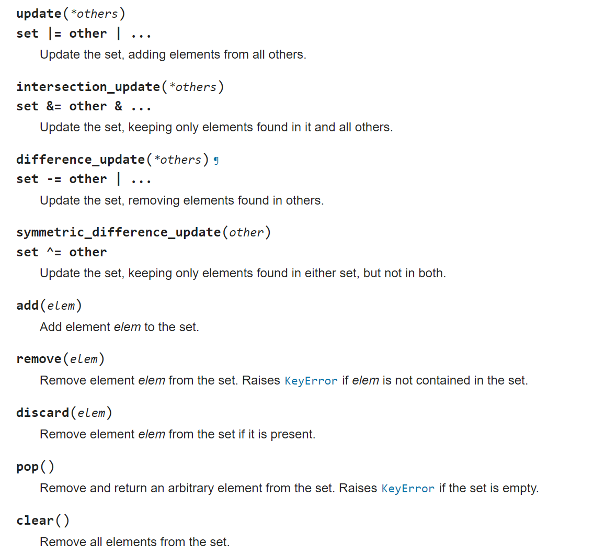

# Bit Operation

## Summary

<figure><figcaption></figcaption></figure>

a ^ b = c implies a = b ^ c or b = a ^ c

So if we have a set of prefix\_xor where prefix\_xor\[i] = 0 ^ nums\[1] ^ nums\[2] ^... ^ nums\[i - 1]

We can find the xor results of numbers between i and j by prefix\_xor\[j + 1] ^ prefix\_xor\[i]&#x20;

Quick Practise:

* [https://leetcode.com/problems/bitwise-ors-of-subarrays/description/](https://leetcode.com/problems/bitwise-ors-of-subarrays/description/)&#x20;
* (a ^ b) & (a ^ c) = a & (b ^ c) [https://leetcode.com/problems/find-xor-sum-of-all-pairs-bitwise-and/description/](https://leetcode.com/problems/find-xor-sum-of-all-pairs-bitwise-and/description/)


## Two-complements

From Wiki

[https://en.wikipedia.org/wiki/Two%27s\_complement](https://en.wikipedia.org/wiki/Two's_complement)

* How to get / isolate the rightmost 1-bit : `x & (-x)`.

<figure><figcaption></figcaption></figure>

* How to turn off (= set to 0) the rightmost 1-bit : `x & (x - 1)`.


## Python bin() and patching

Python bin() built-in function return 0b + bit representation of a number

Python \~ work on signed int, so directly use \~ to find the invert of 1 bit will yield unexpected result, try use a ^ \~ a or a + \~ a instead.

Negative numbers are written with a leading one instead of a leading zero.

Python doesn't use 8-bit numbers. It USED to use however many bits were native to your machine, but since that was non-portable, it has recently switched to using an INFINITE number of bits. Thus the number -5 is treated by bitwise operators as if it were written "...1111111111111111111011".

If we keep on shifting the negative number to the right, we will end up with 11111.... eventually



Patching&#x20;

```python
def patch(bit):
    n = len(bit)
    patch = ["0"] * (8 - n)
    return "".join(patch) + bit
```

## Use of AND Properties

201  Find common prefix by shifting right, then restore the common prefix - [https://leetcode.com/problems/bitwise-and-of-numbers-range/description/](https://leetcode.com/problems/bitwise-and-of-numbers-range/description/)

Useful to find words with no intersect character.&#x20;

318 . For character - [https://leetcode.com/problems/maximum-product-of-word-lengths/description/](https://leetcode.com/problems/maximum-product-of-word-lengths/description/)


## Use of XOR Properties

Rules:

1. For an array, if we calculate xor of all elements and an element appear twice, its effect to the final xor is 0.&#x20;

136 [https://leetcode.com/problems/single-number/description/](https://leetcode.com/problems/single-number/description/)

137 Combo of XOR and not [https://leetcode.com/problems/single-number-ii/](https://leetcode.com/problems/single-number-ii/)

260 Combo of XOR, right most 1 - bit [https://leetcode.com/problems/single-number-iii/description/](https://leetcode.com/problems/single-number-iii/description/)
