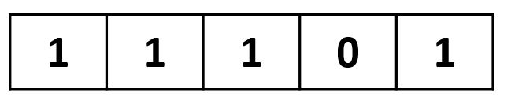
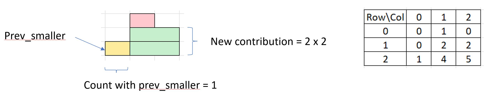

# Monotonic Queue/Stack

## Property

* All elements on the queue/stack are strictly increasing or decreasing&#x20;
* Allow finding of previous smaller/larger element in O(1) time
* Python deque structure can be used to access the bottom (left) of the stack in O(1) -> Useful if we need to maintain and keep the order for k elements&#x20;

<figure><figcaption><p>Key concept on monotonic stack</p></figcaption></figure>

## Use cases

### Finding the next smaller/ greater element in one pass (O (n))

Direct and simple

#### Variations

Find the maximum area of a histogram

Count the max area formed by 0 / 1 in a matrix (iterate every layer as base and treat the connecting cells as a histogram to find the max area)

Count the sub-matrix formed by 0 / 1 in a matrix (hard question)

* In general approach, we need to count the sub-matrix with each layer as the base and add them up
* Then apply some histogram and monotonic stack properties in counting the new sub-matrix formed

#### Example Question

1504 Count Submatrixes with all ones [https://leetcode.com/problems/count-submatrices-with-all-ones/](https://leetcode.com/problems/count-submatrices-with-all-ones/)

Step 1: Way to count 1 - D array

<figure><figcaption></figcaption></figure>

```python
# Count total submatrixes with all ones in 1-D
length = 0, total = 0
for i in range(len(A)):
    if A[i] == 1:
        length += 1
        total += length
    else:
        length = 0
```

Step 2: Convert 2-D array to 1-D to use monostack

<figure><figcaption></figcaption></figure>

Step 3: Count the submatrixed form by adding last col , with reference to property below

<figure><figcaption></figcaption></figure>

Sample Code

```python
class Solution:
    def numSubmat(self, mat: List[List[int]]) -> int:
        m = len(mat)
        n = len(mat[0])
        heights = [0] * n
        total = 0
        # Iterate each row, for each row iterate each col to update heights[]
        for row in range(m):
            for col in range(n):
                if mat[row][col] == 1:
                    heights[col] += 1
                else:
                    heights[col] = 0
            # Count the submatrixes
            total += self.count_sum(heights)
        return total
            
    def count_sum(self, heights: List[int]) -> int:
        """Helper function to count submatrixes"""
        #stack keep track on prev_smaller element (idx, heights)
        mono_stack = []
        n = len(heights)
        #counts[] keep the sum up till current col
        counts = [0] * n
        total = 0
        for i, h in enumerate(heights):
            #pop all larger element than current
            while mono_stack and mono_stack[-1][1] >= h:
                mono_stack.pop()
            
            if mono_stack:
                # we got a prev_low
                prev_idx = mono_stack[-1][0]
                counts[i] = counts[prev_idx]
                counts[i] += h * (i - prev_idx)
            else:
                # we can extend all the way to left end
                counts[i] = h * (i + 1)
            total += counts[i]
            mono_stack.append((i, h))
        return total
```


### Finding the subaray with mininum / maximum length satifying certain condition&#x20;

Example:

Find the minimum length of the subarray with sum > k

Find the maximum sum for subarrays with length < k

Solution:

all elements are positive integer -> sliding windows mayb suffix

elements contain negative integer

**A monotonic queue (deque) working on the prefix\_sum is required**&#x20;

To pop the item from the left side (for items exceeding the distance) or&#x20;

the right side (maintaining strictly increasing property)


### Counting subarrays with operation on the min/max elements

Example:

Find the total score of subarrays with the given formula related to the minimum/maximum in the subarray.&#x20;

Solutions:&#x20;

* Need to work in reverse,&#x20;
  * For each element, find out how many subarrays is having it as the minimum / maximum&#x20;
  * aka find how much this element is contributing to the total&#x20;
  * generally,  subarray\_count = ( curr - prev ) \* (next - curr ) &#x20;
* Pop the stack when a new item is equal to or greater/smaller than the stack top.&#x20;
  * Equal so that we pop and count the contribution of the stack top, it doesn't overlap with the contribution from the new item&#x20;


## Algorithm to find the previous lesser element

```python
// the stack store the previous lesser element(ple) index
def find_ples(nums:List[int]) -> List[int]:
    ples = [default value] * len(nums)
    stack = collections.deque()
    for i, num in enumerate(nums):
        while stack and nums[stack[-1]] >= num:
            stack.pop()
        if stack:
            ples = stack[-1]
        stack.append(i)
    return ples
```

## Algorithm to find the next minimum element

```python
// the stack store the next lesser element(nle) index
def find_nles(nums:List[int]) -> List[int]:
    nles = [default value] * len(nums)
    stack = collections.deque()
    # Example, nums = [3, 2, 3]
    # starting from 3, 
    # the stack is empty (no update), add 3 -> stack = [3]
    # next iterate till 2, stack top (3) is > 2, 
    # pop the stack and update the idx nles[0] to be 1
    # last iteration, stack top (2) is not > 3, no update
    for i, num in enumerate(nums):
        while stack and nums[stack[-1]] > num:
            prev = stack.pop()
            nles[prev] = i
        stack.append(i)
    return nles
```

## Interesting Questions

Construct BST from Preorder [https://leetcode.com/problems/construct-binary-search-tree-from-preorder-traversal/](https://leetcode.com/problems/construct-binary-search-tree-from-preorder-traversal/)

Hint:&#x20;

Maintain a strictly decreasing monostack&#x20;

if curr val < stack.top, attach curr val as new node to the left of the stack.top

else keep popping the stack, curr val node will be the right node of the last popped node

append curr val node into the stack

Kept the reference to the first node (which is the root of the BST) and return

## Idea for hard question


126 Max Tree : [https://www.lintcode.com/problem/126/](https://www.lintcode.com/problem/126/)

Idea : Use the property of mono stack to continuously update the max of the smaller element on the left and the max of the smaller elements on the right. Because we need to keep the max element at the end use monotonically decreasing stack .

````python
```python
def max_tree(self, a: List[int]) -> TreeNode:
        # write your code here
        if not a:
            return None
        n = len(a)
        if n == 1:
            return TreeNode(a[0])
        
        # maintain the nodes in a strictly decreasing monostack 
        stack = []
        # the max node will located at stack[0]
        # when poping the stack during before node entry, the last node popped is the 
        # greatest of smaller element of the left
        # the stack top's right will then be the curr element
        for num in a:
            node = TreeNode(num)
            while stack and stack[-1].val < num:
                node.left = stack.pop()
            if stack:
                stack[-1].right = node
            stack.append(node)
        return stack[0]
```
````

1778: [https://www.lintcode.com/problem/1778/](https://www.lintcode.com/problem/1778/)

We need to find the smallest of next greater/equal and the gre&#x61;_&#x74;_&#x65;st of next smaller/equal element index efficiently. We need info on two dimensions, first dimension on the relative value of all elements, second dimensions on the relative idx position.&#x20;

One way is to use the tuple of (val, idx), sorted by val from small to large and idx from small to large, iterate through the tuple list, and use a mono stack to maintain the idx as strictly decreasing. Thus if the mono stack is pop, we found the smallest of the next greater/equal for the popped idx.&#x20;

Similar, for the greatest of next smaller/equal element. Sort the tuples by val from large to small and idx from small to large.&#x20;

iterate through the tuple list, and use a mono stack to maintain the idx as strictly decreasing. Thus if the mono stack is pop (ie the idx is smaller than the current idx) , we found the smallest of the next greater/equal (which is the current idx) for the popped idx.

Questions involving subarray count

XOR\_SUM [https://www.lintcode.com/problem/346/](https://www.lintcode.com/problem/346/)

Note: Total number of subarray with the center idx = (center - left) \* (right - center)

